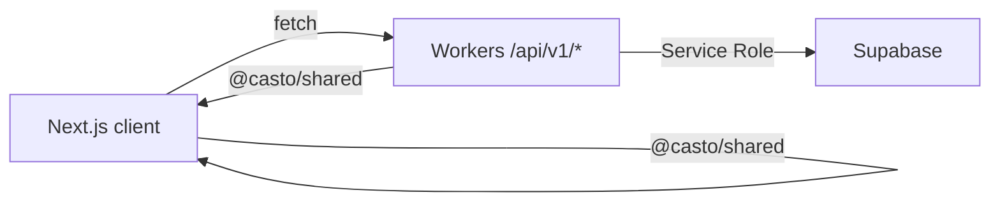

# 🏗️ casto アーキテクチャ

## システム構成

```
┌─────────────────┐
│   ユーザー      │
└────────┬────────┘
         │
    ┌────▼─────┐
    │ Next.js  │ (apps/web)
    │ Frontend │ ← @casto/shared
    └────┬─────┘
         │
    ┌────▼──────────┐
    │ Cloudflare    │ (apps/workers)
    │ Workers API   │ ← @casto/shared
    └────┬──────────┘
         │
    ┌────▼─────┐
    │ Supabase │
    │ Database │
    └──────────┘
```

- **共通パッケージ（`packages/shared/`）** が Web と Workers の両方から参照され、型定義・ユーティリティ・レスポンス整形ロジックを共有します。[DRY][SF]
- フロントエンドは Supabase に直接接続せず、Workers API を経由してデータを取得します。[SFT]

## プロジェクト構成

### モノレポ構造

```
casto/
├── apps/
│   ├── web/              # Next.js フロントエンド
│   └── workers/          # Cloudflare Workers API
├── packages/
│   └── shared/           # 共通型・ユーティリティ（@casto/shared）
├── supabase/
│   ├── schema/           # DDL定義（人手で編集）
│   ├── migrations/       # 生成マイグレーション
│   └── sync              # スキーマ差分生成スクリプト
└── docs/
    ├── setup/            # 環境構築・運用手順
    └── tasks/            # タスク管理
```

### packages/shared の役割

- **型定義**: `SupabaseUserRow`、`UserResponse`、`UsersListResponse` など、Workers と Web で共通の型を提供。[CA]
- **ユーティリティ**: `serializeUserResponse()`、`buildUsersListResponse()` などのデータ変換関数。[DRY]
- **一貫性**: Workers / Web 双方から `@casto/shared` をインポートし、レスポンス形式を統一。[ISA]
- **参照例**: `apps/web/src/app/test/` が共通型を利用した実装リファレンスとなっています。[TDT]

詳細: `README.md` の「開発の道しるべ」を参照。

## API 配置方針

### Cloudflare Workers (`apps/workers/src/features/`)

- **用途**: 汎用 API、認証、決済など外部公開が必要な処理。[SF]
- **特徴**: 独立した API サーバー、複数クライアント対応、エッジ配信。
- **構成**: 機能ごとに `features/<name>/routes.ts` と `service.ts` で実装。
- **型**: `@casto/shared` の型を再エクスポートし、Workers 専用の `Bindings` 型のみローカル定義。[PEC]
- **詳細**: [`docs/setup/WORKERS_STRUCTURE.md`](./setup/WORKERS_STRUCTURE.md) を参照。

### Next.js Route Handlers (`apps/web/src/app/api/`)

- **用途**: フロントエンド専用の軽量処理、SSR 用データフェッチ（現状未使用）。
- **方針**: 必要に応じて後から追加しますが、現在は Workers API に統一しています。[SF]

## データベース接続

### フロントエンド → Workers API → Supabase

- フロントエンドは Workers API (`/api/v1/*`) 経由でデータ取得します。[SFT]
- Supabase への直接接続は行わず、セキュリティ・権限管理を Workers で一元化。[CA]
- `NEXT_PUBLIC_API_BASE_URL` で Workers エンドポイントを参照。

### Workers → Supabase

- `SUPABASE_SERVICE_ROLE_KEY` でサーバー側から接続。
- RLS は `USING (false)` で維持し、Service Role のみ操作可能。[SFT]
- スキーマ更新手順は [`docs/setup/SUPABASE_SCHEMA_MANAGEMENT.md`](./setup/SUPABASE_SCHEMA_MANAGEMENT.md) を参照。

## ディレクトリ構造

### フロントエンド (`apps/web/src/`)

```
app/
  liff/           # LINE ミニアプリ（LIFF SDK 利用）
  test/           # 開発テストページ（★実装リファレンス）
shared/
  api/            # Workers API 呼び出しクライアント
  hooks/          # データフック（useLiffAuth, useUsersData など）
  ui/             # 共通 UI コンポーネント（Button, Card, etc.）
```

- **`apps/web/src/app/test/`** が Workers API とのデータ連携、共通型の利用例として機能します。[TDT]
- 新規機能実装時はこのディレクトリを参照し、レスポンス整形や UI 連携パターンを踏襲してください。[DRY]

### API (`apps/workers/src/`)

```
app.ts            # Hono アプリ本体（CORS・ルーティング・エラーハンドリング）
index.ts          # エントリポイント（app.ts から export）
config/
  env.ts          # 環境設定（development / production 切替）
features/
  <feature>/
    routes.ts     # API endpoints（例: /api/v1/users）
    service.ts    # ビジネスロジック・DB 操作
lib/              # 汎用インフラ（auth・supabase 等）
middleware/       # 認証コンテキスト（authContext.ts）
types/
  index.ts        # 型の re-export（@casto/shared から import）
  bindings.ts     # Hono Bindings（Cloudflare Workers 専用）
  supabase.ts     # @casto/shared の再エクスポート（重複排除）
```

- `types/supabase.ts` は `@casto/shared` から再エクスポートし、Workers 側で独自定義を持ちません。[PEC][DRY]
- 詳細構成は [`docs/setup/WORKERS_STRUCTURE.md`](./setup/WORKERS_STRUCTURE.md) を参照してください。

### 共通パッケージ (`packages/shared/src/`)

```
types/
  user.ts         # User 関連型（SupabaseUserRow, UserResponse, etc.）
  profile.ts      # Profile 関連型（今後追加予定）
utils/
  user.ts         # User データ変換（serializeUserResponse, etc.）
index.ts          # 公開 API（export * from './types/...'）
```

- Workers と Web から `@casto/shared` としてインポートします。[CA]
- 新規機能用の型・ユーティリティは `packages/shared/src/types/<feature>.ts` と `utils/<feature>.ts` に追加してください。[SF]

## 命名規則

- **機能別ファイル**: プレフィックスで統一（例: `TestUserTable.tsx`、`useTestUsers.ts`）。[ISA]
- **共通ファイル**: 機能名のみ（例: `DataTable.tsx`、`usePagination.ts`）。
- **依存方向**: `<feature>/` → `shared/` は可、逆は禁止。[CA]

## フロントエンド ↔ バックエンド連携



1. **Next.js**: `NEXT_PUBLIC_API_BASE_URL` で Workers API (`/api/v1/*`) を呼び出し。
2. **Workers**: `features/<feature>/routes.ts` が `lib/supabase.ts` の Service Role クライアントで DB アクセス。
3. **共通型**: `@casto/shared` を Workers / Web 双方で利用し、レスポンス形式を統一。[DRY]
4. **参照実装**: `apps/web/src/app/test/` がデータフェッチ・整形・UI 連携の実例。[TDT]

共通ロジック（認証、DB 接続、環境設定）は `lib/`・`middleware/`・`config/` に集約します。[SF]

## 環境構築・運用手順

- **ローカル開発**: [`docs/setup/LOCAL_DEVELOPMENT.md`](./setup/LOCAL_DEVELOPMENT.md) - Docker Compose での起動、禁止事項。
- **Supabase スキーマ管理**: [`docs/setup/SUPABASE_SCHEMA_MANAGEMENT.md`](./setup/SUPABASE_SCHEMA_MANAGEMENT.md) - テーブル追加・マイグレーション手順。
- **Workers 構成**: [`docs/setup/WORKERS_STRUCTURE.md`](./setup/WORKERS_STRUCTURE.md) - API 追加・ディレクトリ配置ルール。
- **タスク管理**: [`docs/tasks/TODO.md`](./tasks/TODO.md) - 進行中タスクと完了履歴。

## 実装リファレンス

新規機能実装時は以下を参照してください:

- **Workers API**: `apps/workers/src/features/users/` - routes.ts と service.ts の構成例。
- **Web UI**: `apps/web/src/app/test/` - Workers API 連携、共通型利用、データフック、UI コンポーネント統合のサンプル。[TDT]
- **共通型**: `packages/shared/src/types/user.ts` - Workers / Web で共有する型定義。
- **ユーティリティ**: `packages/shared/src/utils/user.ts` - DB レスポンスを整形する関数群。

---

**最終更新**: 2025/10/04
