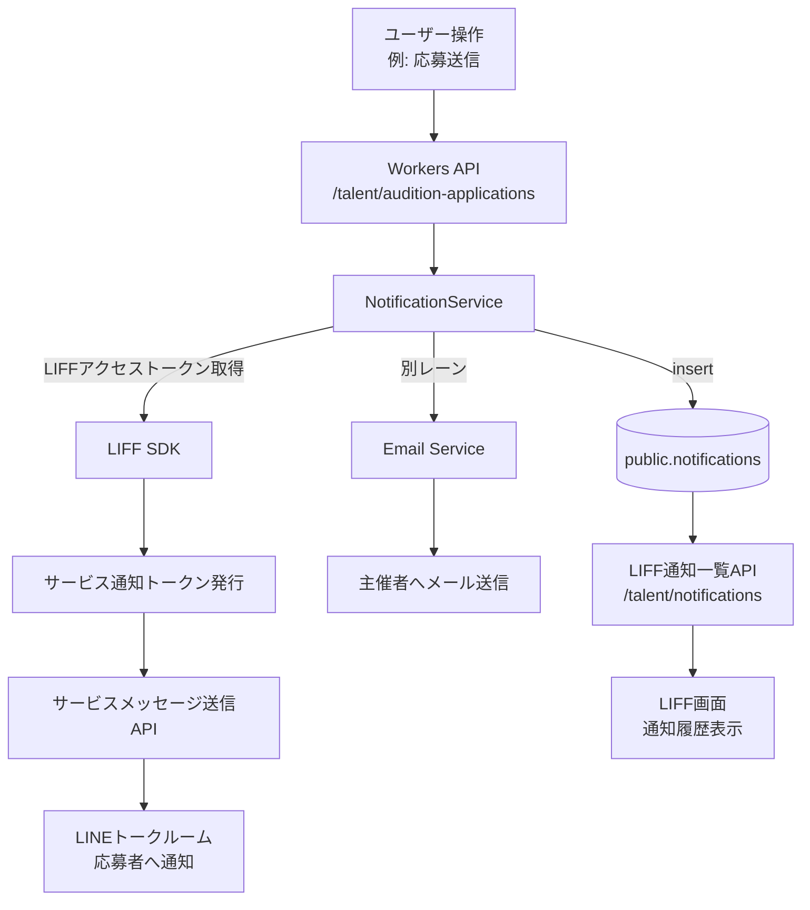

# 通知機能ドラフト

## 1. 背景と目的
- **利用者ロール**: 応募者（LIFF内のLINEユーザー）、オーディション主催者（メール通知）、社内管理者（将来的にWeb管理画面）。
- **現状**: `public.notifications` テーブルと関連型（`packages/shared/src/types/notification.ts`）は用意済みだが、通知生成・配信の実装が未着手。
- **目的**: 各種イベントをトリガとして、適切なチャネルへ通知を送信し、状態管理（未読・既読）や再通知を柔軟に拡張できる設計を固める。

## 2. 既存資産の整理
- **テーブル**: `public.notifications`
  - 主要カラム: `user_id`, `type`, `title`, `message`, `reference_type`, `reference_id`, `read_at`。
  - 未読管理は `read_at IS NULL` で判定。`20251018000000_add_unread_status.sql` で `is_read` 相当の拡張予定あり。
- **型定義**: `packages/shared/src/types/notification.ts`
  - `NotificationType` 候補: `application_received`, `new_application`, `application_accepted`, `application_rejected`, `audition_deadline_reminder`, `audition_status_changed` 等。
- **インフラ**: Workers `Bindings` で `NOTIFICATION_QUEUE` が予約済み (`apps/workers/src/types/bindings.ts`)。
- **UI**: 未実装。LIFF側に通知一覧ページを追加予定。主催者はメールが主体。

## 3. 通知チャネル方針（最終決定版）

### 応募者（LINE）- コスト最小化戦略
- **基本：LINEミニアプリ「サービスメッセージ」（無料）**
  - 認証済みミニアプリで利用可能。友だち追加不要で到達。
  - ユーザー操作（応募、予約等）に対する確認・通知のみ許可（広告・プロモーション禁止）。
  - 1つの操作につき最大5通まで送信可能。
  - 対象：応募完了、一次通過/不通過、面談予約確定、リマインド（前日・当日）、最終合否。
  
- **補助：LINE公式アカウントプッシュ（有料枠）**
  - 新着オーディション一斉告知、週次まとめ、PRキャンペーン等。
  - 無料枠（Communication：月500通）を活用し、超過時はLight/Standard検討。
  - 友だち追加が前提。

- **LIFF内通知一覧**
  - 全通知履歴を表示（`/liff/notifications`）。
  - 既読管理とアーカイブ機能。

### 主催者（メール）- 0コスト想定
- **AWS SES / SendGrid**（無料枠または低コスト）
  - 新規応募通知、予約確認、ノーショウ警告、締切通知。
  - テンプレート化して自動送信。
  - 将来的に主催者向けLINE OAも検討可能だが、初期はメール固定。

### 管理者（Web管理画面）
- Phase 4 以降で検討。イベントログとして閲覧可能にする。

## 4. 配信シナリオ別・送信レーン設計

| # | シーン | トリガー | 送信先 | レーン | 料金区分 | 実装優先度 |
|---|--------|----------|--------|--------|----------|-----------|
| 1 | 応募完了 | タレントが応募フォーム送信 | 応募者 | サービスメッセージ | 無料 | ⭐️⭐️⭐️ 最優先 |
| 2 | 新規応募通知 | 応募受付完了と同時 | 主催者 | メール(SES) | 無料枠 | ⭐️⭐️⭐️ 最優先 |
| 3 | 一次通過/不通過 | ステップ評価で `passed/failed` に更新 | 応募者 | サービスメッセージ | 無料 | ⭐️⭐️⭐️ 最優先 |
| 4 | 面談予約確定/変更 | 面談予約時 | 応募者 | サービスメッセージ | 無料 | ⭐️⭐️ Phase 2 |
| 5 | 面談リマインド（前日19:00） | 予約前日の定期バッチ | 応募者 | サービスメッセージ | 無料 | ⭐️⭐️ Phase 2 |
| 6 | 面談リマインド（当日1時間前） | 予約当日の定期バッチ | 応募者 | サービスメッセージ | 無料 | ⭐️⭐️ Phase 2 |
| 7 | 最終発表（個別合否） | 最終ステップ評価完了 | 応募者 | サービスメッセージ | 無料 | ⭐️⭐️⭐️ 最優先 |
| 8 | 新着オーディション一斉告知 | オーディション公開 | フォロワー | OAプッシュ | 有料(無料枠500通/月) | ⭐️ Phase 3 |
| 9 | 週次まとめ/PR | 週1回の定期バッチ | フォロワー | OAプッシュ | 有料(無料枠500通/月) | ⭐️ Phase 3 |
| 10 | 主催者向けダイジェスト | 日次/週次バッチ | 主催者 | メール(SES) | 無料枠 | ⭐️ Phase 3 |

### 重要な制約事項
- **サービスメッセージ**: 1つの操作（応募、予約等）につき最大5通まで。広告・プロモーション文言は禁止。
- **テンプレート審査**: LINE Developersコンソールでテンプレート登録後、LINEヤフーの審査通過が必要。
- **開発環境**: 未認証ミニアプリでも「開発用内部チャネル」でテスト可能。公開用は認証済みミニアプリのみ。

## 5. アーキテクチャ案（更新版）

### フロー図


### 主要コンポーネント
1. **NotificationService** (`apps/workers/src/services/notification.service.ts`)
   - イベント受信→`notifications`テーブル登録→外部API呼び出し
   - サービスメッセージ送信：LIFFアクセストークン + チャネルアクセストークンでサービス通知トークン発行
   - メール送信：AWS SES or SendGrid API経由

2. **LINEサービスメッセージ送信**
   - テンプレート：LINE Developersコンソールで事前登録・審査済み
   - 送信フロー：`liff.getAccessToken()` → サービス通知トークン発行 → メッセージ送信
   - レスポンスの新トークンを保存し、後続通知（リマインド等）で利用

3. **通知一覧API** (`apps/workers/src/features/talent/notifications/`)
   - `GET /api/v1/talent/notifications` - 一覧取得（ページネーション・未読フィルタ）
   - `PATCH /api/v1/talent/notifications/:id/read` - 既読化

## 6. データモデル拡張案
- `notifications` テーブルに以下のカラム追加を検討。
  - `context` JSONB: 任意のプレースホルダーを保持し、テンプレートレンダリングに使用。
  - `channel` TEXT: `line`, `email`, `in_app` など複数チャネルを同時記録。
  - `metadata` JSONB: 冪等性チェックに利用（例: 同一イベントの二重送信防止）。
- 通知テンプレート管理
  - 初期は TypeScript 定義でハードコード。
  - 将来的には `notification_templates` テーブルを追加し、管理画面から編集可能にする。

## 7. API ドラフト
- `GET /api/v1/talent/notifications`
  - 認証ユーザーの通知一覧を返却。`NotificationFilterOptions` をクエリで利用。
- `PATCH /api/v1/talent/notifications/:id/read`
  - 既読化。`MarkNotificationReadRequest` を利用。
- `POST /api/v1/internal/notifications`
  - 内部用。サービスロールのみ。独自イベントから通知を作成するための入口。

## 8. 詳細なディレクトリ構成案

### Workers側（apps/workers/src/）
```
apps/workers/src/
├── lib/                              # 共通ユーティリティ
│   ├── auth.ts                       # 既存
│   ├── supabase.ts                   # 既存
│   ├── imageProcessor.ts             # 既存
│   ├── notification.service.ts       # ⭐️新規：通知ディスパッチャ
│   ├── line-service-message.ts       # ⭐️新規：LINEサービスメッセージ送信
│   └── email.service.ts              # ⭐️新規：メール送信サービス
├── config/
│   └── notification-templates.ts     # ⭐️新規：通知テンプレート定義
├── features/
│   ├── talent/
│   │   ├── applications/             # 既存
│   │   ├── auditions/                # 既存
│   │   ├── genres/                   # 既存
│   │   └── notifications/            # ⭐️新規：通知一覧API
│   │       ├── service.ts
│   │       └── routes.ts
│   └── organizer/
│       ├── applications/             # 既存（通知ロジック追加）
│       └── auditions/                # 既存
└── types/
    └── bindings.ts                   # 環境変数追加
```

### 共通型定義（packages/shared/src/types/）
```
packages/shared/src/types/
├── notification.ts                   # ⭐️拡張：context, channel等追加
└── lineServiceMessage.ts             # ⭐️新規：LINEサービスメッセージ用型
```

### Web側（apps/web/src/app/liff/）
```
apps/web/src/app/liff/
├── auditions/                        # 既存
├── applications/                     # 既存
└── notifications/                    # ⭐️新規：通知一覧画面
    ├── page.tsx
    └── components/
        └── NotificationListClient.tsx
```

## 9. テンプレート定義の詳細例

### apps/workers/src/config/notification-templates.ts
```typescript
import type { NotificationType } from '@casto/shared/types/notification'

export interface NotificationTemplate {
  // LINE Developersコンソールに登録するテンプレート名
  templateName: string
  // 通知タイトル（トーク画面に表示）
  title: string
  // メッセージ本文生成関数
  message: (context: Record<string, any>) => string
  // LIFFへのDeep Link（オプション）
  actionUrl?: (context: Record<string, any>) => string
  // テンプレート変数のマッピング
  params?: (context: Record<string, any>) => Record<string, string>
}

export const notificationTemplates: Record<NotificationType, NotificationTemplate> = {
  application_received: {
    templateName: 'application_received_ja',
    title: '応募を受け付けました',
    message: (ctx) => 
      `${ctx.auditionTitle} への応募が完了しました。選考結果は通知でお知らせします。`,
    actionUrl: (ctx) => 
      `line://app/${process.env.LIFF_ID}?redirect=/applications/${ctx.applicationId}`,
    params: (ctx) => ({
      audition_title: ctx.auditionTitle,
      application_id: ctx.applicationId,
      button_uri_1: `line://app/${process.env.LIFF_ID}?redirect=/applications/${ctx.applicationId}`
    })
  },
  
  application_accepted: {
    templateName: 'application_passed_ja',
    title: '選考通過のお知らせ',
    message: (ctx) => 
      `おめでとうございます！${ctx.auditionTitle} の${ctx.stepName}を通過しました。`,
    actionUrl: (ctx) => 
      `line://app/${process.env.LIFF_ID}?redirect=/applications/${ctx.applicationId}`,
    params: (ctx) => ({
      audition_title: ctx.auditionTitle,
      step_name: ctx.stepName,
      button_uri_1: `line://app/${process.env.LIFF_ID}?redirect=/applications/${ctx.applicationId}`
    })
  },
  
  application_rejected: {
    templateName: 'application_failed_ja',
    title: '選考結果のお知らせ',
    message: (ctx) => 
      `${ctx.auditionTitle} の選考結果をお知らせします。残念ながら今回は見送りとなりました。`,
    actionUrl: (ctx) => 
      `line://app/${process.env.LIFF_ID}?redirect=/applications/${ctx.applicationId}`,
    params: (ctx) => ({
      audition_title: ctx.auditionTitle,
      button_uri_1: `line://app/${process.env.LIFF_ID}?redirect=/applications/${ctx.applicationId}`
    })
  },
  
  new_application: {
    templateName: 'new_application_email',
    title: '新しい応募が届きました',
    message: (ctx) => 
      `${ctx.applicantName} さんが ${ctx.auditionTitle} に応募しました。`,
    // 主催者向けはメールなのでactionUrlなし
  },
  
  audition_deadline_reminder: {
    templateName: 'deadline_reminder_ja',
    title: '応募締切が迫っています',
    message: (ctx) => 
      `${ctx.auditionTitle} の応募締切が ${ctx.deadlineDate} に迫っています。`,
    actionUrl: (ctx) => 
      `line://app/${process.env.LIFF_ID}?redirect=/auditions/${ctx.auditionId}`,
    params: (ctx) => ({
      audition_title: ctx.auditionTitle,
      deadline_date: ctx.deadlineDate,
      button_uri_1: `line://app/${process.env.LIFF_ID}?redirect=/auditions/${ctx.auditionId}`
    })
  },
  
  audition_status_changed: {
    templateName: 'audition_status_changed_ja',
    title: 'オーディション情報が更新されました',
    message: (ctx) => 
      `${ctx.auditionTitle} の情報が更新されました。詳細をご確認ください。`,
    actionUrl: (ctx) => 
      `line://app/${process.env.LIFF_ID}?redirect=/auditions/${ctx.auditionId}`,
    params: (ctx) => ({
      audition_title: ctx.auditionTitle,
      button_uri_1: `line://app/${process.env.LIFF_ID}?redirect=/auditions/${ctx.auditionId}`
    })
  }
} as const
```

### メール用テンプレート（同じファイル内）
```typescript
export interface EmailTemplate {
  subject: string
  htmlBody: (context: Record<string, any>) => string
  textBody: (context: Record<string, any>) => string
}

export const emailTemplates: Partial<Record<NotificationType, EmailTemplate>> = {
  new_application: {
    subject: '【Casto】新しい応募が届きました',
    htmlBody: (ctx) => `
      <h2>新しい応募が届きました</h2>
      <p><strong>オーディション名:</strong> ${ctx.auditionTitle}</p>
      <p><strong>応募者:</strong> ${ctx.applicantName}</p>
      <p><strong>応募日時:</strong> ${ctx.appliedAt}</p>
      <p><a href="${ctx.reviewUrl}">応募詳細を確認する</a></p>
    `,
    textBody: (ctx) => `
新しい応募が届きました

オーディション名: ${ctx.auditionTitle}
応募者: ${ctx.applicantName}
応募日時: ${ctx.appliedAt}

応募詳細を確認: ${ctx.reviewUrl}
    `
  }
}
```

## 9. 運用・拡張ガイドライン
- **べき等性**: `reference_id + type` のユニーク制約でダブル送信を防止。
- **再送管理**: キュー処理で `retry` ポリシーを設定（メール送信のリトライ回数や待機時間）。
- **ロギング**: Workers 側で通知生成ログと送信ログを `CACHE` または Cloud Logging に出力。
- **ドキュメント整備**: 通知追加時は本ドラフトを更新し、`docs/tasks/TODO.md` の該当タスクを必ず更新すること。

## 10. 段階的実装計画（開発環境でテスト可能）

### Phase 1: サービスメッセージ基盤整備（⭐️⭐️⭐️ 最優先）

#### Step 1-1: LINE Developers コンソール設定
- [ ] LINEミニアプリチャネル確認（開発用内部チャネル）
- [ ] サービスメッセージテンプレート登録
  - `application_received` - 応募受付完了
  - `application_passed` - 一次通過
  - `application_failed` - 一次不通過
  - `application_final_accepted` - 最終合格
- [ ] テンプレート変数定義（auditionTitle, applicantName 等）
- [ ] 開発環境でのテスト用ユーザー追加

#### Step 1-2: データベース拡張
```sql
-- notifications テーブル拡張
ALTER TABLE public.notifications ADD COLUMN IF NOT EXISTS context JSONB;
ALTER TABLE public.notifications ADD COLUMN IF NOT EXISTS channel TEXT;
ALTER TABLE public.notifications ADD COLUMN IF NOT EXISTS service_notification_token TEXT;
```
- [ ] マイグレーションファイル作成 `20251018000001_extend_notifications.sql`
- [ ] `supabase db push` で適用
- [ ] Workers 再デプロイ

#### Step 1-3: NotificationService 実装
- [ ] `apps/workers/src/services/notification.service.ts` 作成
- [ ] `apps/workers/src/services/line-service-message.service.ts` 作成
  - サービス通知トークン発行ロジック
  - サービスメッセージ送信ロジック
  - レスポンストークン保存ロジック
- [ ] Bindings に環境変数追加
  ```typescript
  LINE_MINI_APP_CHANNEL_ID: string
  LINE_MINI_APP_CHANNEL_SECRET: string
  ```

#### Step 1-4: 応募完了通知の実装
- [ ] `apps/workers/src/features/talent/audition-applications/routes.ts` 修正
  - POST `/api/v1/talent/audition-applications` に通知ロジック追加
- [ ] フロント側で `liff.getAccessToken()` を送信するよう修正
- [ ] 開発環境でテスト
  ```bash
  # LIFF起動 → 応募送信 → LINEトークルームに通知到達確認
  ```

#### Step 1-5: ステップ評価通知の実装
- [ ] `apps/workers/src/features/organizer/applications/routes.ts` 修正
  - PATCH `/api/v1/organizer/auditions/:id/applications/:appId` に通知ロジック追加
  - ステータス変更時に `passed/failed` 判定して通知送信
- [ ] 開発環境でテスト
  ```bash
  # 主催者画面で評価更新 → 応募者のLINEに通知到達確認
  ```

### Phase 2: メール通知実装（⭐️⭐️⭐️ 最優先）

#### Step 2-1: AWS SES 設定
- [ ] AWS SES アカウント作成（開発環境用）
- [ ] 送信元メールアドレス認証
- [ ] テスト用受信メールアドレス追加（Sandbox 環境）
- [ ] Bindings に環境変数追加
  ```typescript
  AWS_SES_REGION: string
  AWS_ACCESS_KEY_ID: string
  AWS_SECRET_ACCESS_KEY: string
  FROM_EMAIL: string
  ```

#### Step 2-2: EmailService 実装
- [ ] `apps/workers/src/services/email.service.ts` 作成
- [ ] メールテンプレート定義（TypeScript）
  - `new_application` - 新規応募通知（主催者向け）
  - `application_status_changed` - 応募ステータス変更
- [ ] NotificationService にメール送信ロジック追加

#### Step 2-3: 新規応募メール通知実装
- [ ] POST `/api/v1/talent/audition-applications` にメール送信ロジック追加
- [ ] 主催者のメールアドレス取得（`organizer_profiles` テーブル）
- [ ] 開発環境でテスト
  ```bash
  # 応募送信 → 主催者メールアドレスに通知到達確認
  ```

### Phase 3: LIFF通知一覧UI（⭐️⭐️）

#### Step 3-1: 通知一覧API実装
- [ ] `apps/workers/src/features/talent/notifications/` ディレクトリ作成
- [ ] `service.ts` - 通知取得・既読化ロジック
- [ ] `routes.ts` - API エンドポイント
  - `GET /api/v1/talent/notifications` - 一覧取得
  - `PATCH /api/v1/talent/notifications/:id/read` - 既読化
- [ ] `apps/workers/src/app.ts` にルーティング追加

#### Step 3-2: LIFF通知画面実装
- [ ] `apps/web/src/app/liff/notifications/page.tsx` 作成
- [ ] `NotificationListClient.tsx` コンポーネント作成
- [ ] 未読バッジ表示
- [ ] 既読/未読フィルタ
- [ ] 開発環境でテスト
  ```bash
  # LIFF起動 → 通知一覧表示 → 既読化動作確認
  ```

### Phase 4: リマインド機能（⭐️ Phase 3以降）
- Cloudflare Cron Triggers 利用
- サービス通知トークンを使った後続メッセージ送信

### テスト環境での確認項目
- [ ] 開発用内部チャネルでサービスメッセージ送信成功
- [ ] `public.notifications` テーブルに正しくレコード登録
- [ ] LIFF画面で通知一覧表示
- [ ] 既読/未読ステータス管理
- [ ] メール送信（SES Sandbox 環境）
- [ ] べき等性確認（同一イベントの二重送信防止）

### 本番環境移行前チェック
- [ ] LINEミニアプリを認証済みに変更
- [ ] サービスメッセージテンプレートの審査通過
- [ ] AWS SES を本番モード（Sandbox 解除）に変更
- [ ] 環境変数の本番設定確認
- [ ] RLS ポリシーの最終確認
